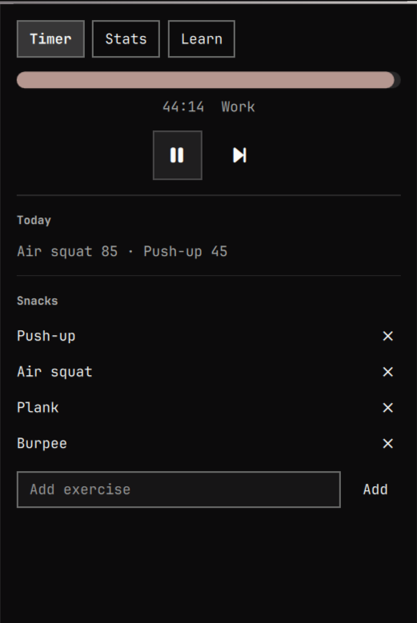
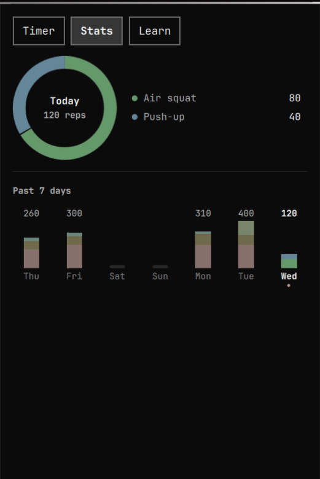
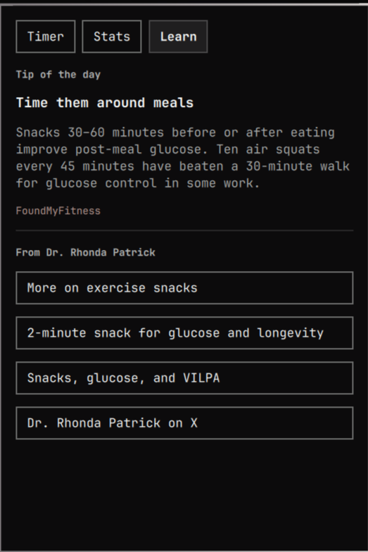
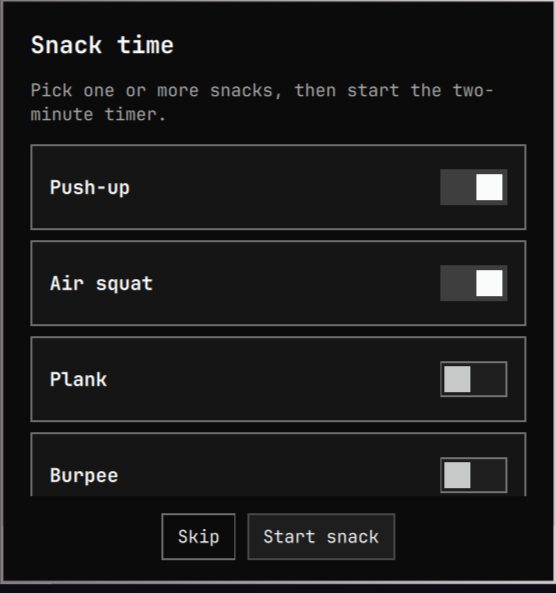

# Exercise Snacks

A timer for the [Omarchy](https://omarchy.org/) bar that reminds you to do "exercise snacks". When the interval ends, a
popup asks you to pick one or more exercises — push-up, air squats, plank, burpee — then runs a two-minute timer and
lets you log how many you did.

The Stats tab has a donut of today's exercises and a seven-day history and the Learn tab has some useful information
about the benefits of exercise snacks and links to Dr. Rhonda Patrick's posts on the subject

<p align="center">
  
  
  
</p>

## Install

```bash
omarchy plugin add https://github.com/filipenf/exercise-snacks.git --enable
```

For local development:

```bash
PLUGIN_ID="filipenf.exercise-snacks"
PLUGIN_DIR="$HOME/.config/omarchy/plugins/$PLUGIN_ID"
mkdir -p "$PLUGIN_DIR"
rsync -a --delete --exclude '.git' ./ "$PLUGIN_DIR/"
omarchy plugin validate "$PLUGIN_DIR"
omarchy-shell shell rescanPlugins
omarchy plugin enable "$PLUGIN_ID" --section right
```

## Use

Hover over the icon on the bar to see the remaining time, click it to open the panel. The work interval starts on its
own and resets if your computer goes idle for more than two minutes

| Control | Action                                       |
| ------- | -------------------------------------------- |
| Pause   | Pause or resume the current interval         |
| Skip    | Snack now (or skip the current overlay step) |

When time is up you'll see a popup:

  

1. Pick one or more snacks from your list
2. Start the two-minute snack
3. Enter how many reps you did, then Save

Skip on the overlay starts the next work interval without logging. 

The Learn tab (`n` with the panel open; `t` returns to Timer, `s` opens Stats) has a rotating tip and links to
FoundMyFitness. The links open in your browser, the plugin doesn't require network access

Stats shows today's logged snacks as a donut (click a day in the week strip to inspect it) and total reps for the past
seven days. Days before this update have no history.

  

The exercise list is editable so you can add or delete snacks as you see fit. The default exercises are simple and
require no equipment: push-up, air squats, plank, burpee

## Keyboard

With the panel open:

- `h` / `l` or arrows select Pause or Skip
- Enter or Space activates the selected control
- Escape closes the panel
- Tab / Shift+Tab moves between bar panels

## Configure

```bash
omarchy bar plugin set filipenf.exercise-snacks workMinutes 45 --json
omarchy bar plugin set filipenf.exercise-snacks snackSeconds 120 --json
```

New values apply to the next interval. Add or remove snacks on the Timer tab. The catalog, today's totals, and up to 30
days of history live in `~/.local/state/omarchy/exercise-snacks.json`. Today's log still resets at local midnight;
previous days stay in `days`.

## Update

```bash
omarchy plugin update filipenf.exercise-snacks
```

## Uninstall

```bash
omarchy plugin disable filipenf.exercise-snacks
omarchy plugin remove filipenf.exercise-snacks
```

To also delete the log:

```bash
rm ~/.local/state/omarchy/exercise-snacks.json
```

## Tests

```bash
node --test tests/model.test.js
omarchy plugin validate .
qmllint -I "$OMARCHY_PATH/shell" BarWidget.qml Panel.qml Overlay.qml Service.qml CircularProgress.qml DonutRing.qml
```

## License

MIT.
